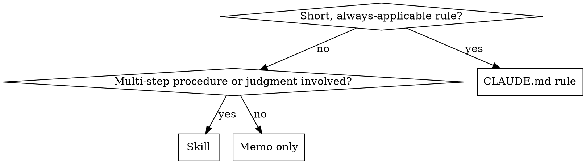

# Retrospective Codify

At the tail end of a task, extract the "if I'd known this up front, I wouldn't have detoured" knowledge and lock it down as either a project- or user-global rule, or a skill. Prefer reproducible, prompt-independent forms.

## When to use

- Just before task completion, or when the user says "save the learnings" / "make a rule"
- When you reached the solution after trial and error (got stuck on the first move, tested a wrong hypothesis, lost time to insufficient documentation)
- When there's a real chance you'll do a similar task again

When NOT to use:
- Trivial tasks that worked on the first try (no learning to extract)
- One-off project-specific fixes (the commit message is enough)

## Workflow

1. **Failure ⇄ success mapping**: write down these three from the just-finished task.
   - Initial attempt (what you did / how it failed)
   - Final solution (what worked)
   - The bridging insight (why the initial attempt didn't reach)

2. **Verbalize "what I should have known up front"**: summarize the insight in 1-3 sentences. Write it as an *instruction to your future self*, not a retrospective ("Don't X" / "Always check Y first").

3. **Classify**: use the decision table below to pick a destination.

4. **Deduplication check (mandatory)**: before proposing anything, search existing artifacts. If a duplicate or near-duplicate rule exists, choose "amend existing" rather than "add new." Skipping this bloats the skill and rule library.

   Pull 2-3 search keys from the insight (tool name, API name, symptom term, antonym). Example: insight "use `npm ci` in CI" → keys `npm`, `ci`, `lockfile`.

   Where to search and the minimum queries:
   ```
   # Skill duplicates (global)
   ls ~/.claude/skills/
   Grep "<key>" ~/.claude/skills/*/SKILL.md

   # CLAUDE.md duplicates
   Grep "<key>" ~/.claude/CLAUDE.md
   Grep "<key>" <project-root>/CLAUDE.md   # if applicable
   ```

   Bucket results into 4 categories:
   - **New**: no hits → propose normally
   - **Amend existing**: a related skill/rule exists and the new info is complementary → propose "amend"
     - "Partial overlap" (some of the insight is covered, the rest is new) belongs here. Put the overlapping part in "Duplicate detection" and the new part in "Adoption candidates" (`[skill amend]` or `[rule]`).
   - **Duplicate of existing (no proposal needed)**: an existing artifact fully covers it → no proposal, but keep a "Duplicate detection" line for auditability. Cite the existing skill name + section name (or line number).
   - **Defer judgment**: the agent can't tell whether it's a duplicate → show the search result to the user and ask.

5. **Write out**: produce the artifact using the appropriate template (below).

6. **Confirm**: show the user a diff and get adoption sign-off. If rejected, keep the note in the session only — don't write to a skill.

## Classification



| Decision axis | Destination | Example |
|---|---|---|
| Short, always-applied, no judgment | `CLAUDE.md` (user global / project) | "use `npm ci` in CI, not `npm install`" |
| Procedure / contextual judgment / template needed | New skill or amendment to an existing skill | "Vitest workspace mode setup for monorepo cross-package tests" |
| One-off project-specific | Don't codify (commit message / PR description is enough) | — |

**CLAUDE.md write destination**:
- Cross-language / cross-tool general rule → `~/.claude/CLAUDE.md`
- Specific repo only → that repo's `CLAUDE.md`

## Output templates

### Amendment to CLAUDE.md
```markdown
# <append to existing section>
- <imperative one-liner> (Why: <short reason>)
```
Always include the reason in parentheses (so future-you can judge edge cases).

### New skill
Follow `superpowers:writing-skills` minimum template:
```markdown
---
name: <kebab-case>
description: Use when <specific situation> / <symptom>
---

# <Title>

## Purpose
## When to use
## Workflow
## Pitfalls
```

## Concrete examples

### Example 1: codified to CLAUDE.md (short always-applied rule)

- Initial attempt: ran `npm install` in CI; lockfile-format diff broke the build
- Final solution: switched to `npm ci`
- Insight: `install` mutates the lockfile; CI must use `ci` to enforce it exactly

→ Append to `~/.claude/CLAUDE.md` "Tooling" section:
```markdown
- Use `npm ci` in CI, not `npm install` (Why: `install` mutates the lockfile and produces unreviewed diffs)
```

### Example 2: codified to a new skill (multi-step procedure with judgment)

- Initial attempt: tried to share a single Vitest config across packages in a monorepo; tests in package A failed to find utils from package B's source
- Final solution: enabled Vitest workspace mode with a `vitest.workspace.ts` at the repo root pointing at each package, plus per-package `vitest.config.ts` extending a shared base
- Insight: the shape isn't "one config" — it's "workspace pointer + per-package configs + shared base." Three layers, not one.

→ New skill `vitest-workspace-monorepo` carving out the procedure and templates (or, if a related skill already exists, this becomes "amend existing" via the dedup check).

### Example 3: not codified (project-specific one-off)

- Initial attempt: imported a `.ts` file from a sibling app via relative path; build failed with "module not found"
- Final solution: changed the import to use the public package name resolved by this monorepo's path aliases
- Insight: the resolution rule is unique to this repo's tsconfig and the error is specific enough to debug from. The error message is the documentation.

→ Memo only. PR description is enough.

## Red flags (rationalizations to watch for)

| Surfacing rationalization | Reality |
|---|---|
| "Project-specific, but let's make a skill anyway" | Bloats the skill library and dilutes search. The commit message / PR is enough. |
| "Skip approval; write it now and show later" | Silent edits to CLAUDE.md or a skill make future behavior unpredictable. Always propose → approve → write. |
| "Skip dedup; just delete duplicates later" | Conflicting rules cause split behavior. Dedup is non-negotiable. |
| "The insight is thin, but we should write *something*" | Zero proposals is also valid. An empty retrospective causes no harm. |
| "Skip the failure side; just write the final solution" | Without the failure record, future-you walks back into the same trap. |

## Presentation format to the user

At task end, surface the inventory in this form. **Multiple learnings are fine. Explicitly list duplicates and rejections too — leave the audit trail.**

```
## Retrospective

### Learning 1: <short label>
- Initial failure: <one line>
- Final solution: <one line>
- Insight: <one line>

### Learning 2: <short label>      # omit this block if there's only one
- Initial failure: <one line>
- Final solution: <one line>
- Insight: <one line>

## Proposals

Adoption candidates:
- [skill amend] <existing skill name>: <one line> (from learning N)
- [skill new] <skill name>: <one line> (from learning N)
- [rule] CLAUDE.md (global/project): <one line> (from learning N)

Duplicate detection (no proposal):
- <learning N>: existing <skill/rule name> at <section / line> fully covers → no addition

Rejected:
- <learning N>: <one-line reason> (e.g., project-specific / absorbed by another learning)

Specify which to adopt by number or name. Zero proposals is also a valid conclusion.
```

**Format rules:**
- If there's one learning, omit the `### Learning N` heading and write a single Retrospective block
- Omit any of the three sections (Adoption / Duplicate / Rejected) entirely if empty (don't write "(none)")
- Always tag each proposal line with "(from learning N)" — use "(from learnings 1, 3)" if it spans multiple
- If "Adoption candidates" is empty and only "Duplicate detection" remains, replace the closing line with "No adoption candidates. Review for the record."
- Only write out items the user adopts. Don't write silently.

### Presentation example: all learnings already covered (duplicate detection only)

```
## Retrospective

### Learning 1: <label>
- Initial failure: ...
- Final solution: ...
- Insight: ...

## Proposals

Duplicate detection (no proposal):
- Learning 1: existing skill `<skill name>`'s `<section>` fully covers → no addition

No adoption candidates. Review for the record.
```

### Presentation example: partial overlap (amend existing + duplicate detection)

```
## Proposals

Adoption candidates:
- [skill amend] <existing skill name>: <new portion, one line> (from learning 1, complements existing `<section>`)

Duplicate detection (no proposal):
- Learning 1 (version-value portion): already covered by `~/.claude/CLAUDE.md` Tooling section → no addition
```

## Common failures

- **Granularity too fine**: codifying the one-time specifics (a specific function name, specific version) → abstract up to the "what to verify" level
- **No reason recorded**: the rule's basis is lost; future-you can't tell why to follow it → always include `Why:`
- **Silent writes**: updating CLAUDE.md or a skill without user approval → always propose → approve → write
- **Skip the failure-side**: just writing "final solution X" without why the first attempt failed → future-you falls into the same trap

## Related skills

- `superpowers:writing-skills` — template and TDD flow for writing a new skill
- `update-config` — when changes to settings.json / permissions are needed
- `empirical-prompt-tuning` — sibling: this skill runs *after* a task; empirical-prompt-tuning runs *during* prompt development
